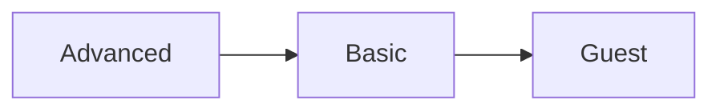
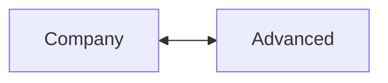

# Задача 1

## Текст задачи

Проанализировать предоставленные вводные данные и разработать документ, описывающий архитектуру системы, для внутреннего использования в любой форме по своему усмотрению. Объём текста не имеет значения.

**Ожидаемый результат:** текстовое описание, которые должно сопровождаться хотя бы одной диаграммой (приветствуется любая автогенерация, например, plantuml или mermaid) и таблицами по желанию.

**Язык:** английский. 

**Вводные данные:**

Некая система реализует определённый набор сервисов для пользователей партнёров. Множества пользователей разных партнёров (провайдеров) не пересекаются. Партнёрам может быть доступна одна и та же функциональность, но набор функций и прав конфигурируется для каждого из них отдельно. Существует несколько типов конечных пользователей: “basic”, “guest”, “company” и “advanced”. Для каждого партнёра этот набор индивидуален. Все сессии “guest”-пользователя ограничены 20 минутами, он не может выполнять более 5 операций в сутки и 20 — за 7 дней, после чего переходит в состояние “idle”. Пройдя процедуру KYC, пользователь приобретает статус “basic” и лимиты повышаются до 20 и 50 соответственно. Для статусов “company” и “advanced” ограничения неприменимы. Возможны переходы: “guest” → “basic” → “advanced”, “advanced” → “basic” → “guest”, “company” → “advanced”, “advanced” → “company”.

## Комментарии

В этой задаче я изменила структуру текста следующим образом:

- В первой части оставила базовую информацию о системе, партнерах и пользователях. Представила ее в виде списка для облегчения восприятия.

- Типы пользователей и их ограничения представила в виде таблицы.

- Переходы статусов представила в виде диаграмм.

Самостоятельно предположила следующее (т.к. во вводных данных не было однозначности/не хватало информации):

- Переход в статус `idle` происходит при превышении лимита по операциям, но не по длительности сессии.

- В статус `idle` при превышении лимита по операциям переходят пользователи как типа `guest`, так и типа `basic`.

## Результат

The system delivers a set of services to the partners’ users. The key aspects:

- Multiple partners may access the same services, but functionality and permission settings are customized separately for each partner.

- User groups of different partners do not overlap.

- Each partner has its individual set of [user types](#user-types).

### User types

The following table provides the available user types and their characteristics:

| User type | Session duration limit | Daily operations limit | Weekly operations limit | Additional information |
| --- | --- | --- | --- | --- |
| `guest`	| 20 minutes | 5 | 20 | If the limit is exceeded, the user is set to the `idle` status |
| `basic` | Unlimited	| 20 | 50 | If the limit is exceeded, the user is set to the `idle` status |
| `company` | Unlimited | Unlimited | Unlimited | — |
`advanced` | Unlimited | Unlimited | Unlimited | — |

### User type transitions

The following diagrams illustrate the available transitions between user types:

